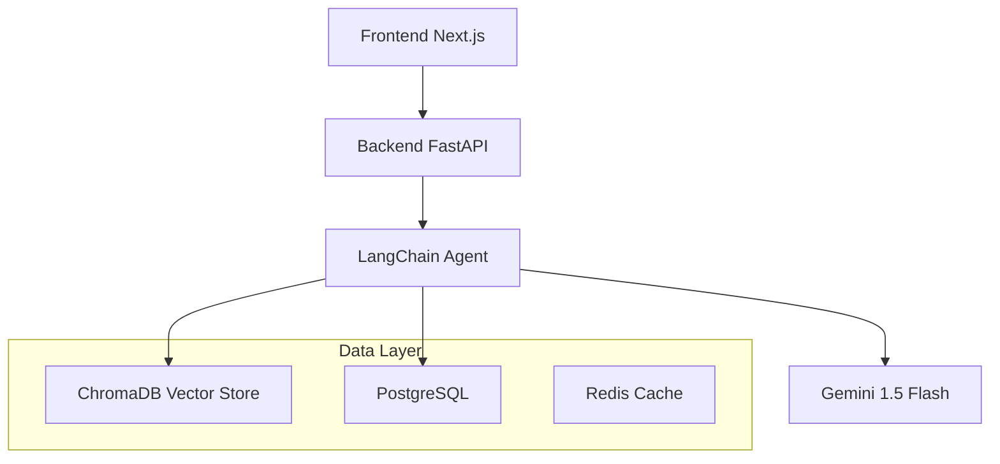

# 🎫 Taskio Pro


**Enterprise AI-Powered Ticket Classification System**

Taskio Pro is a full-stack demonstration of modern AI engineering. It uses **Retrieval-Augmented Generation (RAG)** and **LangChain** to intelligently classify support tickets, leveraging historical data to improve accuracy over time.

---

## 🏗️ Architecture


*(Note: If Mermaid is not supported in your viewer, the flow is: Frontend → FastAPI → LangChain Agent → (ChromaDB + PostgreSQL + Redis) → Gemini LLM)*

## 🚀 Tech Stack

| Component | Technology | Role |
| :--- | :--- | :--- |
| **Frontend** | Next.js 14 + TypeScript | Terminal-style UI, Type safety |
| **Backend** | FastAPI + Python 3.11 | Async API, Business Logic |
| **AI Engine** | LangChain + Gemini 1.5 | Orchestration & Classification |
| **Data** | ChromaDB + PostgreSQL | Vector Store (RAG) & Relational Data |
| **Infra** | Docker Compose + Redis | Containerization & Caching |

## ✨ Key Features

* **🧠 RAG Architecture:** Injects context from similar past tickets to increase classification accuracy.
* **🛡️ Robust Engineering:** Features Pydantic structured output, fallback handling, and Redis caching.
* **⚡ Real-time Feedback:** Correction endpoint allows the model to learn from human overrides.
* **📊 Analytics:** Tracks classification confidence, latency (avg ~450ms), and cache hit rates.

## 📦 Quick Start

**Prerequisites:** Docker & [Google Gemini API Key](https://makersuite.google.com/app/apikey).
```bash
# 1. Clone & Configure
git clone https://www.github.com/consoletree/taskio
cd taskio-pro
cp .env.example .env  # Add your GOOGLE_API_KEY in .env

# 2. Launch
docker-compose up --build

# 3. Access
# Frontend: http://localhost:3000
# API Docs: http://localhost:8000/docs
```

## 📡 API Usage

**Classify a Ticket**
```bash
POST /api/tickets
{
  "title": "WiFi not working",
  "description": "I cannot connect to the office network..."
}
```

**Response (Simplified)**
```json
{
  "category": "Network Issue",
  "confidence": 0.94,
  "reasoning": "User explicitly mentions connectivity failure...",
  "rag_used": true
}
```

## 📂 Project Structure
```text
taskio-pro/
├── backend/
│   ├── app/services/classifier.py  # LangChain Agent logic
│   ├── app/core/vector_store.py    # ChromaDB RAG logic
│   └── app/api/                    # FastAPI Routes
├── frontend/                       # Next.js Application
├── database/                       # SQL Init scripts
└── docker-compose.yml              # Orchestration
```

## 📊 Performance Benchmark

| Metric | Result |
| :--- | :--- |
| **Latency (Cold)** | ~450ms |
| **Latency (Cached)**| ~5ms |
| **Accuracy** | ~87% (w/ RAG) |

---

*Built for portfolio demonstration purposes.*
